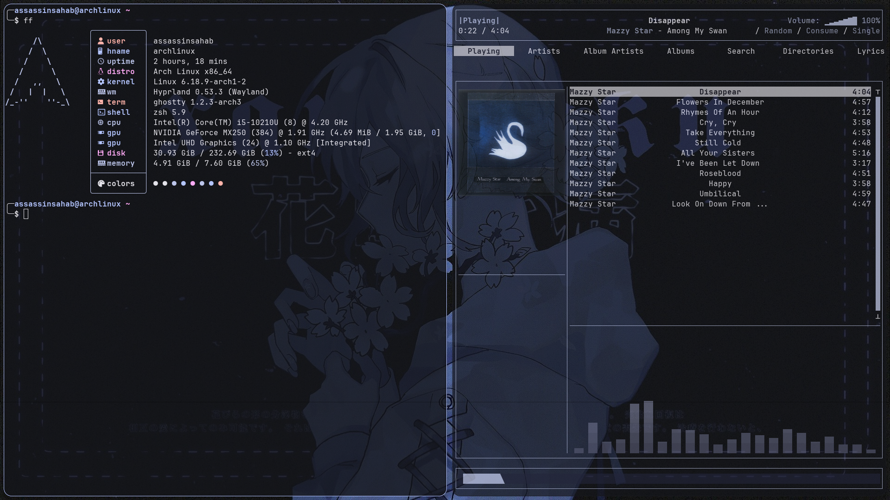
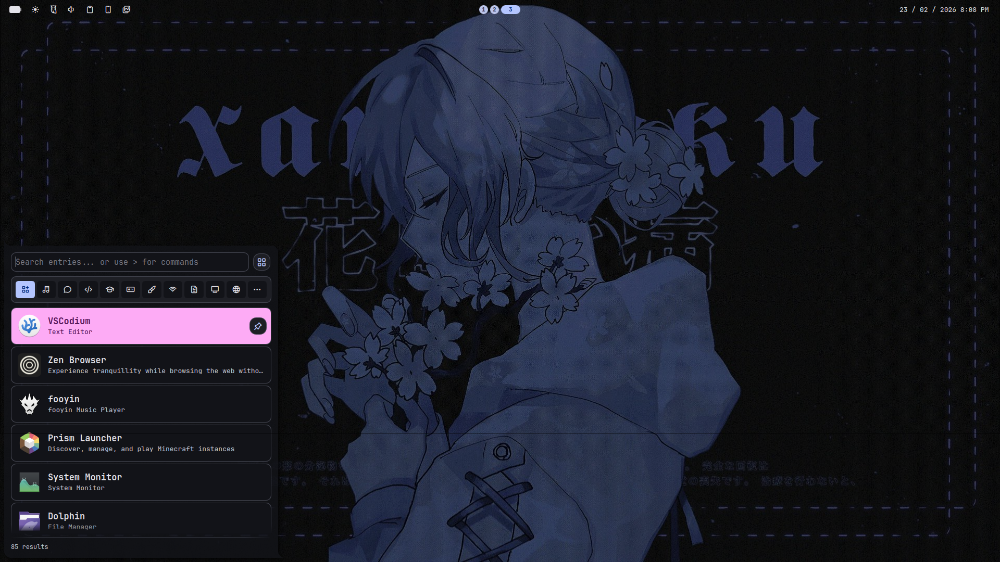

# 🧊 Dotfiles

Personal Arch Linux setup managed with **GNU Stow**.

## 🖥️ Environment

| Component        | Program   |
|------------------|-----------|
| Window Manager   | Hyprland  |
| Shell / UI       | Noctalia  |
| Terminal         | Ghostty   |
| Visualizer       | Cava      |
| Music Client     | rmpc      |

> Noctalia handles the bar and app launcher.

## 📸 Previews

### Terminal / rmpc



### Bar / Launcher



## 📦 Management

Configs are organized per application and symlinked using:

```bash
stow <package>